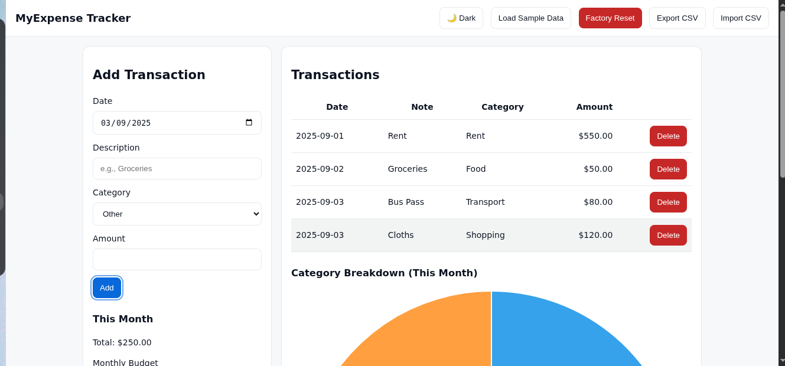
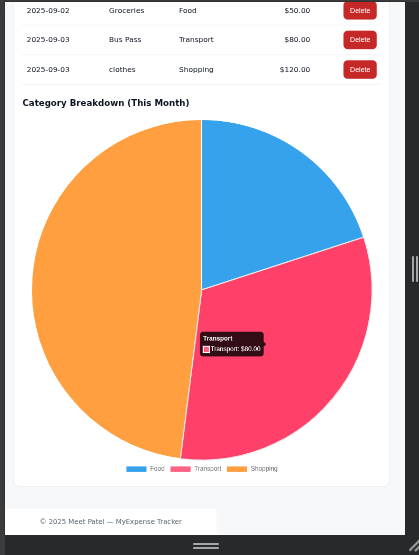

# MyExpense Tracker

A lightweight web app to track daily expenses, set a monthly budget, and visualize spending by category.  
Built with **HTML, CSS, and JavaScript** (no backend).
I built this project as part of my portfolio to practice frontend development and create a simple, real-world expense tracking tool.

---

## ✨ Features
- Add & delete transactions
- Monthly budget with remaining indicator (color-coded)
- Category breakdown pie chart (Chart.js)
- Dark / Light theme toggle (saved to preferences)
- Export to CSV & Import from CSV
- Undo last delete (snackbar)

---

## 🚀 Live Demo
If GitHub Pages is enabled:  
👉 **https://meet-innovate.github.io/myexpense-tracker/**

---

## 📸 Screenshots
Here’s what the app looks like:

  


---

## 📂 Project Structure
```text
myexpense-tracker/
├── index.html
├── style.css
├── script.js
├── screenshot1.png
├── screenshot2.png
└── README.md

```
## 🧰 Tech Stack
- **HTML5**
- **CSS** (custom theme with light/dark modes)
- **JavaScript** (vanilla ES6+)
- **Chart.js** (via CDN)

---

## 🏁 Run Locally
1. Clone the repository:
   ```bash
   git clone https://github.com/meet-innovate/myexpense-tracker.git
   cd myexpense-tracker
---
## 👤 Author
**Meet Patel**  
Bachelor of Science (Honours Specialization) in Computer Science  
Nipissing University, North Bay, ON  

